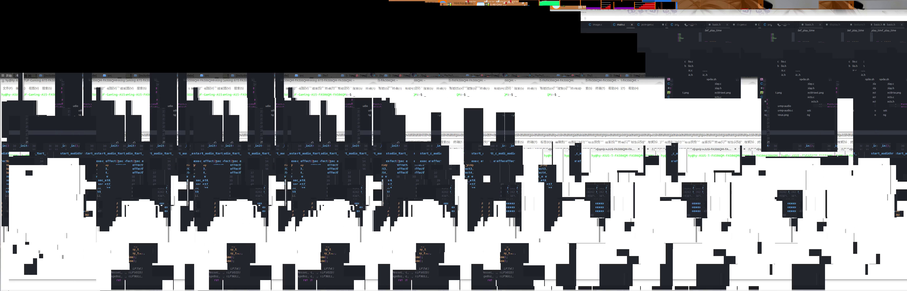
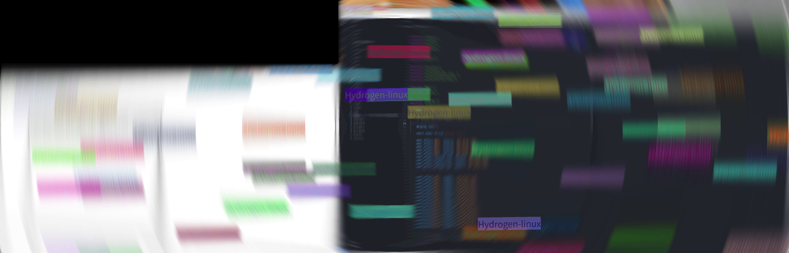
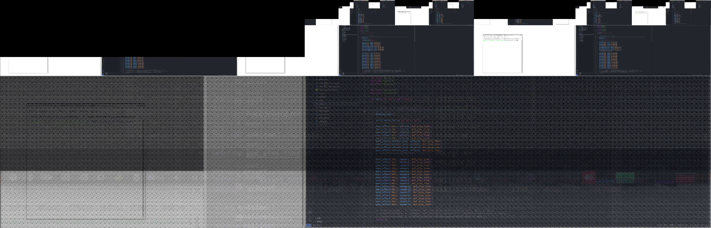
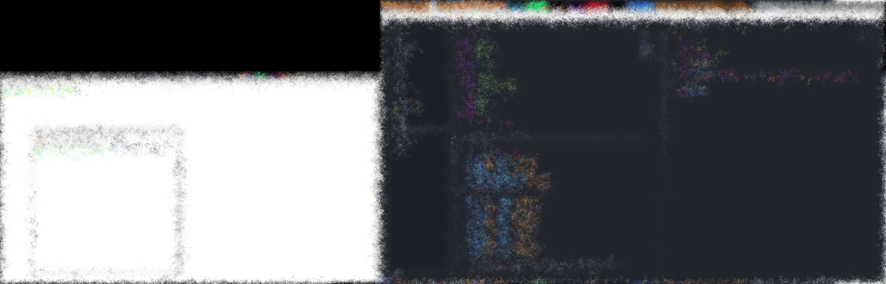
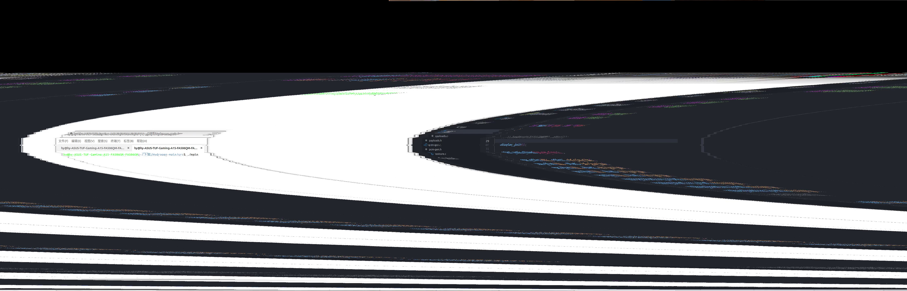
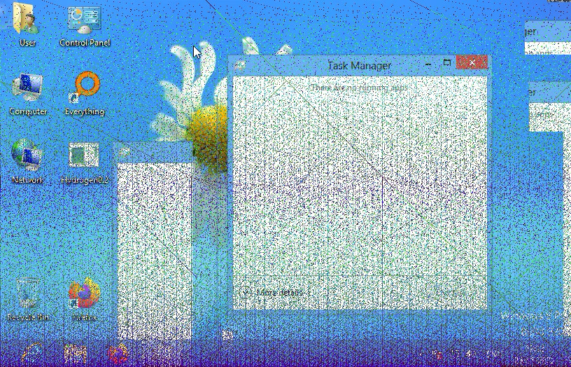
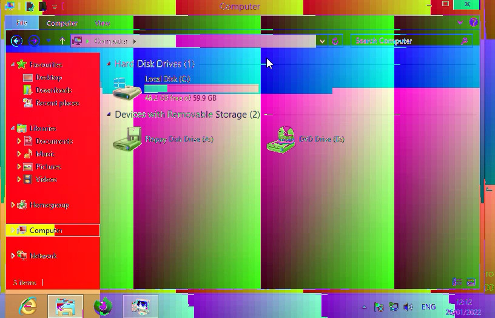
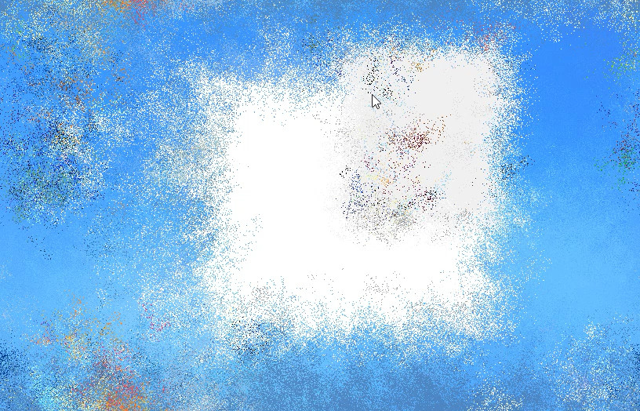
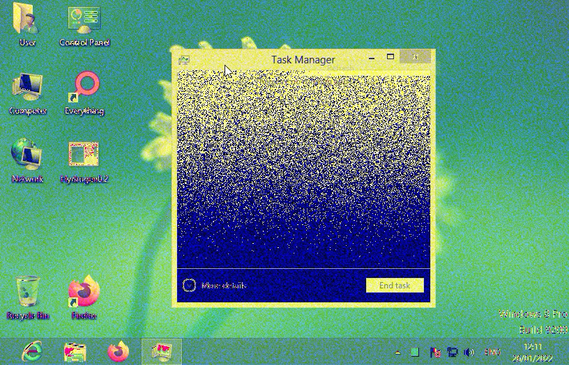
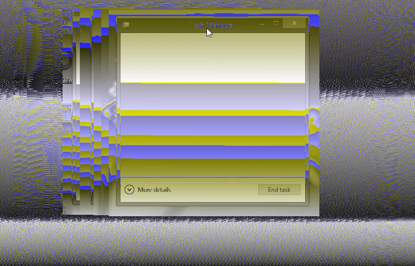

# 关于 Hydrogen-linux

Hydrogen-linux 是一个小型的, 使用了 opengl、xlib与alsa 库的特效程序  
原程序中会破坏数据的部分我都删了\[doge\]  

[到原程序储存库](https://github.com/LeoLezury/Hydrogen)

## 屏幕截图

# 以下是原readme文档内容

**About Hydrogen**

Hydrogen is a small GDI Malware, with some bytebeat music, many payloads and some shaders. 

IF YOU USE THE SOURCE CODE OF THIS PROJECT, THEN YOUR PROJECT MUST BE OPEN SOURCE!
***
**WARNING**

Please open it in VIRTUAL MACHINE. If you don't, then I AM NOT RESPONSIBLE FOR ANY destruction caused by this malware. 

IF YOU HAVE photosensitive epilepsy, DO NOT EXECUTE THIS MALWARE ANYWHERE!
***
**Screenshots**  

***
**Creator and special thanks**

Created by Leo.

Thanks [rCat](https://github.com/srcatt "rCat") for helping and inspiring me!

Also, you can look at his project: [ü.exe](https://github.com/srcatt/u "ü.exe").
